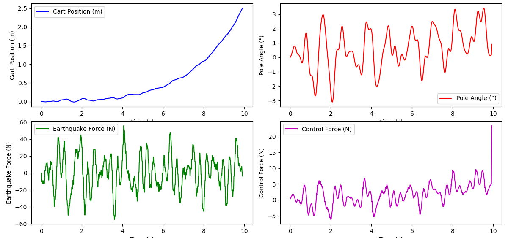
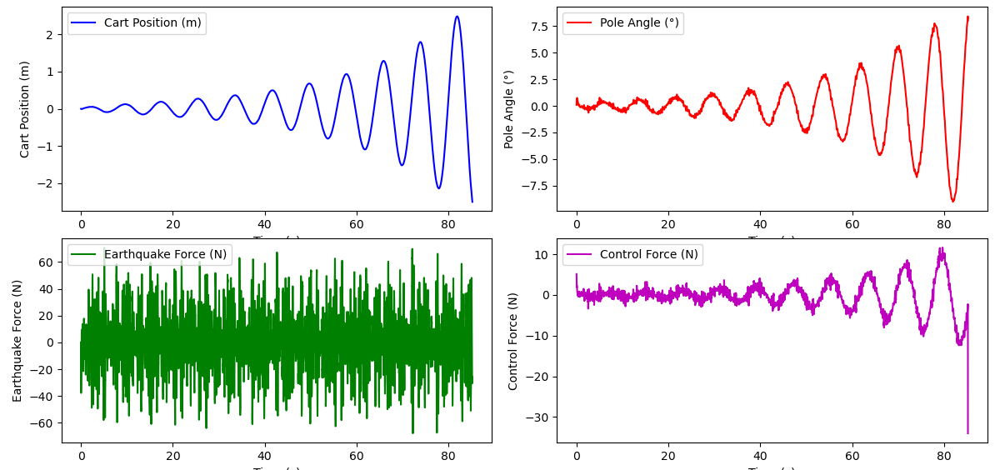

# **Cart-Pole Optimal Control using LQR**
## **(ROS2 + Gazebo)**

**Author:** Ayushman M. (https://github.com/aymisxx)  


## Overview

This project implements a disturbance-rejecting **Linear Quadratic
Regulator (LQR)** controller for a **cart-pole system** in ROS2 + Gazebo.

The objective is to stabilize the inverted pendulum under external
earthquake-like disturbances while maintaining bounded cart displacement
and reasonable control effort.

The system is modeled in continuous-time, controlled using optimal state
feedback, and evaluated through simulation metrics and visual analysis.

------------------------------------------------------------------------

# 1. Problem Statement

The inverted pendulum (cart-pole) is a classical nonlinear control
problem. The goal is:

-   Keep the pole upright ($θ ≈ 0$).
-   Prevent excessive cart displacement.
-   Reject external disturbances.
-   Minimize control effort.

In this implementation, an earthquake disturbance is injected as an
external force acting on the cart.

------------------------------------------------------------------------

# 2. System Modeling

## 2.1 Parameters

```
  Parameter         Value
  ----------------- -----------
  Cart Mass (M)     1.0 kg
  Pole Mass (m)     1.0 kg
  Pole Length (L)   1.0 m
  Gravity (g)       9.81 m/s²
```

------------------------------------------------------------------------

## 2.2 State Vector

The system is modeled in state-space form:

$$x = [x\,\ \dot{x}\,\ \theta\,\ \dot{\theta}]^T$$

Where:

-   ($x$) = cart position.
-   ($\dot{x}$) = cart velocity.
-   ($\theta$) = pole angle.
-   ($\dot{\theta}$) = pole angular velocity.

------------------------------------------------------------------------

## 2.3 Linearized State-Space Model

$$\dot{x} = Ax + Bu$$

### A MATRIX

$$A = \begin{bmatrix} 0 & 1 & 0 & 0 \\ 0 & 0 & \frac{mg}{M} & 0 \\ 0 & 0 & 0 & 1 \\ 0 & 0 & \frac{(M+m)g}{ML} & 0 \end{bmatrix}$$

### B MATRIX

$$B = \begin{bmatrix} 0 \\ \frac{1}{M} \\ 0 \\ -\frac{1}{ML} \end{bmatrix}$$

------------------------------------------------------------------------

# 3. LQR Design

The LQR minimizes:

$$J = \int_0^\infty(x^T Q x + u^T R u) dt$$

Where:

-   Q penalizes state deviation.
-   R penalizes control effort.

The optimal gain:

$$K = R^{-1} B^T P$$

Where ($P$) is the solution of the continuous-time Algebraic Riccati
Equation (ARE).

Control law:

$$u = -Kx$$

------------------------------------------------------------------------

# 4. Implementation Architecture

---

# Dependencies

```
1. Ubuntu 24.04 (This specific work was done on Pop!_OS 24.04, which is based on Ubuntu 24.04). 
2. ROS2 Jazzy.  
3. Gazebo Harmonic / Garden (gz sim).
```

Required ROS2 Packages:

```
sudo apt update

sudo apt install -y \
ros-jazzy-ros-gz-sim \
ros-jazzy-ros-gz-bridge \
ros-jazzy-robot-state-publisher \
ros-jazzy-rviz2 \
ros-jazzy-xacro
```

Python Dependencies:

```
pip install numpy scipy matplotlib
```

---

ROS2 Nodes:

-   `lqr_controller`.
-   `earthquake_force_generator`.
-   `state_republisher`.
-   `force_visualizer`.
-   Gazebo simulator.
-   RViz visualization.

------------------------------------------------------------------------

# 5. Earthquake Disturbance Model

The disturbance is generated as:

$$F(t) = \sum_{i=1}^{N} A_i \sin(2\pi f_i t + \phi_i) + \text{Noise}$$

-   Frequency range: 0.5Hz to 4.0Hz.
-   Random amplitude variation.
-   Gaussian noise component.

This creates realistic unpredictable disturbance.

------------------------------------------------------------------------

# 6. Installation & Build

## 6.1 Clone into ROS2 workspace

``` bash
cd ~/ros2_ws/src
git clone <repo_url>
```

## 6.2 Build

``` bash
cd ~/ros2_ws
colcon build --packages-select cart_pole_optimal_control --symlink-install
source install/setup.bash
```

------------------------------------------------------------------------

# 7. Running the Simulation

``` bash
source /opt/ros/jazzy/setup.bash
source ~/ros2_ws/install/setup.bash

ros2 launch cart_pole_optimal_control cart_pole_rviz.launch.py
```

This launches:

-   Gazebo.
-   LQR controller.
-   Disturbance generator.
-   Visualization tools.

------------------------------------------------------------------------

# 8. Controller Configurations

## 8.1 Baseline Configuration

``` python
Q = diag([1, 1, 1, 1])
R = [[1]]
```

### Behavior

-   Survives briefly.
-   Larger cart drift.
-   Higher angle oscillations.
-   Lower disturbance rejection capability.

------------------------------------------------------------------------

## 8.2 Tuned Configuration (Final)

``` python
Q = diag([40, 10, 80, 60])
R = [[1.5]]
```

### **Design Logic**

- The pole angle (θ) was assigned the highest weight to prioritize upright stabilization.
- The **cart position weight** was **increased moderately** to **limit drift** without over-constraining motion.
- **Velocity terms** were weighted to **improve damping** behavior.
- **R** was **increased slightly** to **prevent excessive control effort** and **reduce aggressive oscillatory response**.

------------------------------------------------------------------------

# 9. Results

All results are available in the `results/` directory:

-   `baseline_run_plot.png`
-   `final_run_plot.png`
-   `CartPole_LQR_Final_Run.mp4`

------------------------------------------------------------------------

## 9.1 Baseline Run



### Discussion

-   Faster divergence under disturbance.
-   Larger cart displacement.
-   Higher angle deviation.
-   Reduced stability duration.

------------------------------------------------------------------------

## 9.2 Final Tuned Run



### Observations

-   Angle remains bounded within acceptable limits.
-   Cart displacement controlled.
-   Improved disturbance rejection.
-   Stable for extended duration.
-   Smooth control effort profile.

------------------------------------------------------------------------

# 10. Performance Metrics (Tuned)

-   Stable duration: ~80+ seconds.
-   Max angle deviation: ~8° to 10°.
-   Max cart displacement: ~2.5m (termination threshold).
-   Average control effort: Moderate.
-   Disturbance rejection: Successful.

------------------------------------------------------------------------

# 11. Termination Conditions

Simulation stops when:

-   **|cart position| > 2.5m**.
-   **|pole angle| > 45°**.
-   Time **exceeds** maximum duration.

------------------------------------------------------------------------

# 12. Key Takeaways

-   LQR provides optimal state feedback for linearized inverted
    pendulum.
-   Proper Q/R tuning significantly improves robustness.
-   Disturbance rejection performance depends strongly on pole-angle
    weighting.
-   Increasing R reduces aggressive control but may reduce correction
    speed.
-   System remains stable under continuous stochastic disturbance.

------------------------------------------------------------------------

# 13. Conclusion

This project successfully implements a disturbance-rejecting LQR
controller for a cart-pole system in ROS2 + Gazebo. The tuned controller
demonstrates improved stability, controlled cart displacement, and
effective disturbance mitigation.

The implementation includes full system modeling, simulation
integration, visualization, and performance analysis.

------------------------------------------------------------------------

### **Academic Context & Acknowledgment**

This micro-project was completed as part of:

**SES 598: Space Robotics & AI**  
Arizona State University  

**Instructor:** Prof. Jnaneshwar Das  
**GitHub:** https://github.com/darknight-007  

**Course Assignment Repository:**

https://github.com/darknight-007/ses598-space-robotics-and-ai-2026

The course is affiliated with the  
**Distributed Robotic Exploration and Mapping Systems (DREAMS) Laboratory**  
**GitHub:** https://github.com/DREAMS-lab  
**Website:** https://deepgis.org/dreamslab  

The assignment/micro-project structure, evaluation methodology, and coverage-control framework were inspired by course material and lab research themes in autonomous systems and robotic exploration.

------------------------------------------------------------------------

### **Author**

Ayushman M. (https://github.com/aymisxx)  
M.S. Robotics & Autonomous Systems (MAE)  
Arizona State University  

------------------------------------------------------------------------

### **License**

Creative Commons Attribution 4.0 International License (CC-BY-4.0)

> see **LICENSE** file.

------------------------------------------------------------------------